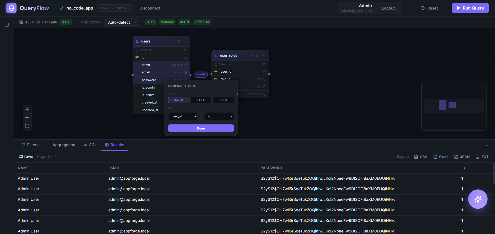
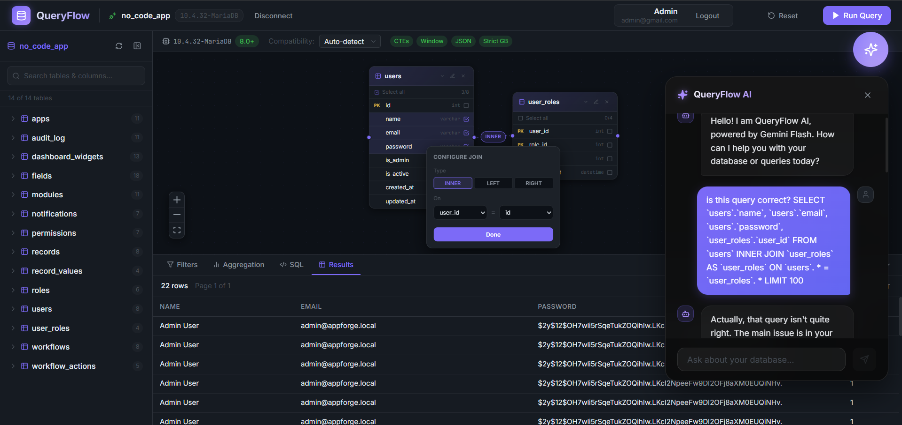
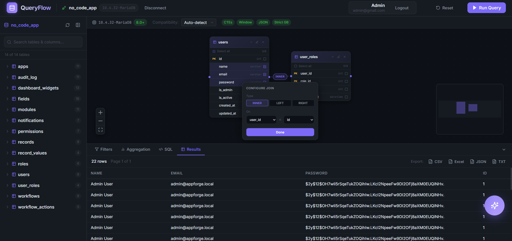
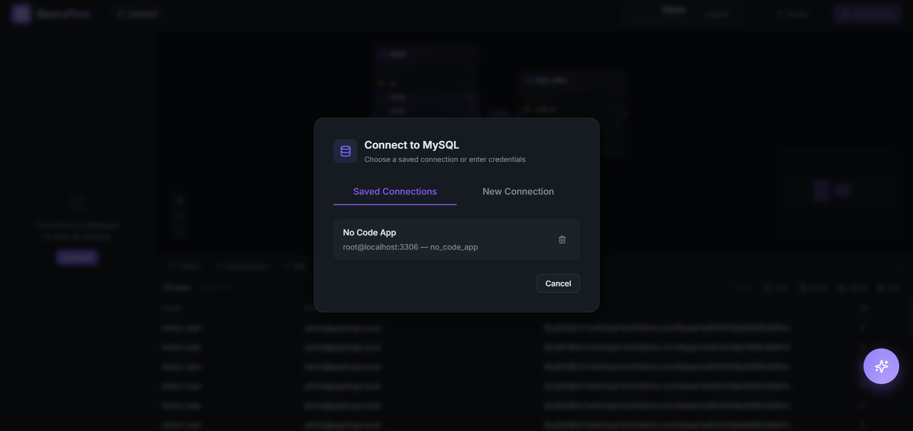
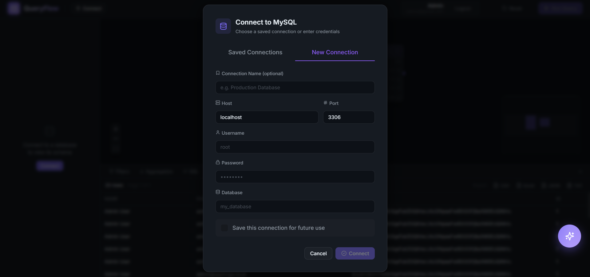
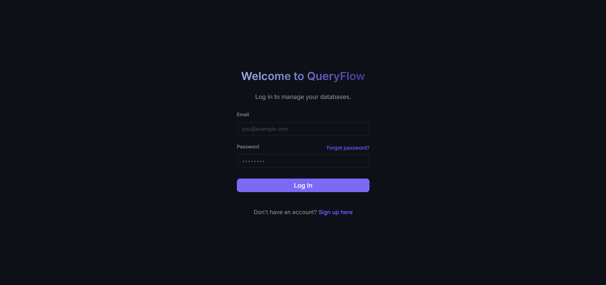

# QueryFlow

> A professional web-based, no-code visual SQL query builder for MySQL — drag tables, draw JOINs, set filters, and run queries without writing a line of SQL. Developed by **Bryan James G. Dionisio**.


---

## 🚀 Overview

QueryFlow is a powerful, intuitive tool designed to bridge the gap between complex database structures and actionable data insights. By providing a high-fidelity visual canvas, users can architect complex MySQL queries through simple drag-and-drop actions, while an integrated AI assistant provides real-time guidance on schema and query optimization.

---

## ✨ Features

### 🤖 AI-Powered Assistant
- **Contextual Guidance** — An integrated QueryFlow AI (powered by Google Gemini 2.0 Flash) that understands your specific database schema and helps you write complex joins and filters.
- **Natural Language Interaction** — Ask questions about your data in plain English and receive formatted, human-like guidance.

### 📊 Visual Query Building
- **Drag & Drop Canvas** — Easily manage table relationships on a highly responsive React Flow canvas.
- **Visual JOIN Builder** — Create INNER, LEFT, and RIGHT joins by simply connecting table nodes.
- **Live SQL Preview** — Watch your SQL statement grow and update in real-time as you modify the visual structure.

### 📁 Data Management & Export
- **Multi-Format Export** — Download your results in professional formats: **CSV**, **Excel (XLS)**, **JSON**, and **TXT**.
- **Query Templates** — Save your visual query definitions to load and reuse them later.

### 🔒 Security & Observability
- **Secure Authentication** — Full-featured auth system with **OTP-based Password Reset** and session management.
- **Audit Logging** — Comprehensive logging for system security, including `signin_logs` (IP, User-Agent) and `query_logs` for performance monitoring.
- **Encrypted Credentials** — Database connection details are secured using AES-256-GCM encryption.

### 🎨 Premium UI/UX
- **Glassmorphism Design** — Modern, translucent interface elements with smooth micro-animations.
- **Global Notifications** — A unified, non-blocking Toast system for immediate system feedback.

---

## 🛠️ Technologies Used

### Frontend
- **React 18** + **Vite** — High-performance frontend framework.
- **Zustand** — Lightweight and scalable state management.
- **React Flow** — Specialized library for node-based visual interfaces.
- **Lucide React** — Premium iconography.
- **Axios** — Robust API client with interceptors for error normalization.

### Backend
- **Node.js** + **Express** — Scalable server architecture.
- **MySQL2** — High-performance database driver with connection pooling.
- **Google Generative AI SDK** — Powering the Gemini Flash AI integration.
- **Nodemailer** — Secure OTP delivery via SMTP.
- **Jose / Crypto** — Advanced encryption and security utilities.

---

## 🚀 Installation & Setup

### Prerequisites
- **Node.js** 18.x or higher
- **MySQL** (Local or Remote instance)
- **SMTP Credentials** (e.g., Gmail App Password for OTPs)
- **Gemini API Key** (from Google AI Studio)

### 1. Clone the Repository
```bash
git clone https://github.com/BryanJamesGDionisio/QueryFlow.git
cd QueryFlow
```

### 2. Install Dependencies
```bash
# Install for both client and server
cd server && npm install
cd ../client && npm install
```

### 3. Configure Environment Variables
Create a `.env` file in the `server/` directory:
```env
PORT=3001
SESSION_SECRET=your_random_secret
CLIENT_ORIGIN=http://localhost:5173

# Internal Database
INTERNAL_DB_HOST=localhost
INTERNAL_DB_USER=root
INTERNAL_DB_PASSWORD=
INTERNAL_DB_NAME=queryflow_system

# AI Configuration
GEMINI_API_KEY=your_google_ai_studio_key

# Email (SMTP)
MAIL_HOST=smtp.gmail.com
MAIL_PORT=587
MAIL_USERNAME=your_email@gmail.com
MAIL_PASSWORD=your_app_password
```

### 4. Start the Application
**Terminal 1 (Server):**
```bash
cd server
npm run dev
```

**Terminal 2 (Client):**
```bash
cd client
npm run dev
```

---

## 📖 Usage Guide

1. **Sign Up**: Create an account and verify your identity.
2. **Connect**: Link your MySQL database by providing credentials. Check "Save Connection" for 1-click access next time.
3. **Build**: Drag tables from the Sidebar to the Canvas.
4. **Relate**: Connect the blue dots between tables to create JOINs.
5. **Configure**: Select columns, add filters, and set aggregations in the bottom panel.
6. **Execute**: Click "Run Query" to see your data instantly.
7. **Export**: Use the export toolbar in the Results tab to download your data in your preferred format.

---

## 🖼️ Screenshots

### 🖥️ Dashboard & Builder

*The primary workspace featuring the drag-and-drop canvas, schema sidebar, and query configuration panels.*

### 🤖 AI Assistant

*Context-aware AI assistant providing schema-specific guidance and SQL optimization tips.*

### 📊 Results & Export

*Paginated results table with the integrated multi-format export toolbar (CSV, Excel, JSON, TXT).*

### 🔗 Connection Management

*Secure vault for saved database connections with quick-reconnect functionality.*


*Encrypted configuration for new MySQL database connections.*

### 🔐 Authentication

*Modern, secure authentication portal featuring premium glassmorphism design.*

---

## 🤝 Contribution

Contributions are welcome! If you'd like to improve QueryFlow:
1. Fork the Project.
2. Create your Feature Branch (`git checkout -b feature/AmazingFeature`).
3. Commit your Changes (`git commit -m 'Add some AmazingFeature'`).
4. Push to the Branch (`git push origin feature/AmazingFeature`).
5. Open a Pull Request.

---

## 👨‍💻 Author

**Bryan James G. Dionisio**
*Software Developer & Architect*

---

## 📄 License

This project is licensed under the MIT License - see the [LICENSE](LICENSE) file for details.
